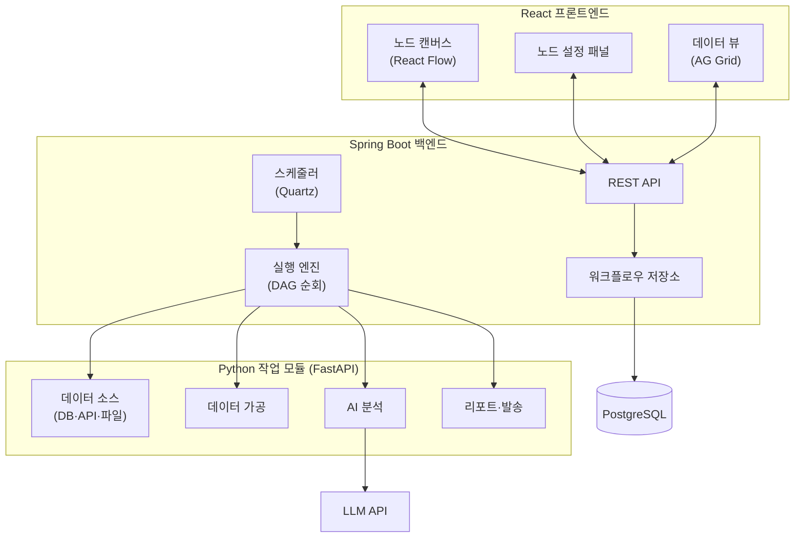
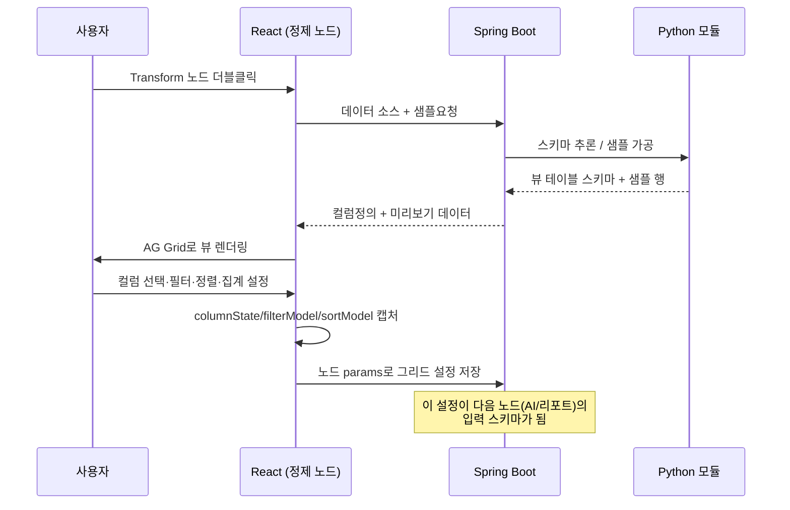
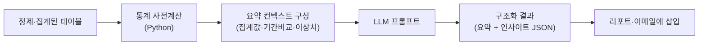
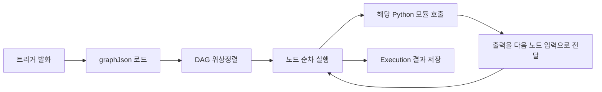

# 1인 1에이전트 — AI 기반 셀프서비스 데이터 자동화 플랫폼

> 기존 RPA(UIPath) 기반 데이터 추출 업무를 현업 사용자가 직접 수행할 수 있도록 지원하는 플랫폼.
> 사용자는 노드를 연결해 자신만의 데이터 조회·분석·AI 리포트·정기 발송 워크플로우를 구성한다.
> RPA 담당자에게 의존하지 않고 모든 구성원이 필요한 데이터를 직접 조회·분석·배포하는 것이 목표이며,
> 궁극적으로는 단순 추출을 넘어 AI 기반 인사이트와 자동 리포트까지 제공하는 개인 맞춤형 데이터 에이전트 플랫폼을 지향한다.

---

## 1. 플랫폼 포지셔닝 / 핵심 가치

UIPath를 단순 대체하는 것이 목적이 아니다. 모든 구성원이 자신의 업무 데이터를 직접 조회·분석하고, AI 인사이트를 얻고, 정기 리포트를 자동 생성하는 **AI 기반 데이터 자동화 플랫폼**을 만드는 것이 최종 목표다.

### 기존 방식 — RPA 담당자 의존


문제점
- RPA 담당자 의존
- 요청 대기 시간 발생
- 반복 업무 증가
- 요구사항 변경 시 추가 개발 필요

### 목표 방식 — 셀프서비스 워크플로우


특징
- 셀프서비스 데이터 조회
- AI 기반 인사이트 생성
- 반복 리포트 자동화
- 비개발자 사용 가능

---

## 2. 시스템 개요

| 영역 | 기술 | 역할 |
|------|------|------|
| 프론트엔드 | React + React Flow + AG Grid | 노드 캔버스, 노드 설정, 데이터 뷰/정제 (가장 중요) |
| 백엔드 | Spring Boot | 워크플로우 저장, 실행 오케스트레이션, 스케줄링, 인증 |
| 작업 모듈 | Python (FastAPI) | DB 조회 / 가공 / AI 분석 / 리포트 / 발송 수행 |
| AI 엔진 | LLM API (예: Claude) + 통계 계산 | 요약·인사이트·이상탐지·트렌드 (차별화 핵심) |
| 저장소 | PostgreSQL + (선택) Redis/MQ | 워크플로우·실행 이력 저장, 비동기 작업 큐 |

핵심 개념: **에이전트 = 하나의 워크플로우(DAG)**.
사용자는 에이전트를 여러 개 만들 수 있고, 각 에이전트는 노드 그래프 하나로 정의된다.

---

## 3. 전체 아키텍처



데이터 흐름의 핵심:
1. 프론트엔드는 노드 그래프를 **JSON(노드 + 엣지)** 으로 만들어 백엔드에 저장한다.
2. 트리거(스케줄/수동)가 실행 엔진을 깨운다.
3. 실행 엔진이 그래프를 위상정렬해 노드를 순서대로 실행하고, 각 노드의 출력을 다음 노드의 입력으로 넘긴다.
4. 실제 작업은 Python 모듈이 수행한다. AI 분석 노드만 LLM을 호출한다. Spring Boot는 **오케스트레이터**, Python은 **무상태(stateless) 작업자**.

---

## 4. 노드 카테고리

3카테고리(스케줄러/작업/결과)에서 **6카테고리**로 확장한다.

| 카테고리 | 핸들(연결점) | 역할 | 대표 노드 |
|----------|-------------|------|-----------|
| Trigger | 출력만 | 워크플로우 시작 | 스케줄, 수동 실행 |
| Data Source | 입력 + 출력 | 데이터 수집 | DB 조회, API 조회, 파일 업로드 |
| Transform | 입력 + 출력 | 데이터 가공 | 컬럼 선택, 필터, 집계, 계산 컬럼, 피벗, 정렬, 상위 N |
| AI Analytics | 입력 + 출력 | AI 분석 (차별화 핵심) | AI 요약, AI 인사이트, 이상 탐지, 트렌드 분석 |
| Visualization | 입력 + 출력 | 미리보기·시각화 | AG Grid, 차트(Bar/Line/Pie) |
| Output | 입력만 | 결과 산출·배포 | Excel 생성, PDF 생성, 이메일 발송, Teams 발송 |

유효 파이프라인: `Trigger → Data Source → (Transform…) → (AI Analytics…) → (Visualization…) → Output`

### 4.1 Trigger
- **스케줄**: Cron / 매일·매주·매월
- **수동 실행**: 즉시 실행

### 4.2 Data Source
- **DB 조회**: DB 선택, 테이블 선택, SQL 작성, 기간 조건 → 출력 `{ columns: [], rows: [] }`
- **API 조회**: REST API, Header, 인증정보
- **파일 업로드**: Excel / CSV / JSON

### 4.3 Transform
- **컬럼 선택**: 사용할 컬럼만 추출
- **필터**: 예) 부서 / 상담사 / 기간 / VOC 유형
- **집계 (GROUP BY)**: 예) 시간별 / 일별 / 월별 / 상담사별 / 부서별
- **계산 컬럼**: 예) `응대율 = 응대건수 / 인입건수`
- **피벗**: 행 → 열 변환
- **정렬**: 오름차순 / 내림차순
- **상위 N**: TOP 10 / BOTTOM 10

### 4.4 AI Analytics (플랫폼 핵심 차별화)
- **AI 요약**: 예) "총 VOC 1,245건 · 주요 유형 ① 요금 문의 ② 해지 방어 ③ 로밍 문의"
- **AI 인사이트**: 예) "요금 관련 VOC가 전주 대비 18% 증가 · 원인 ① 신규 요금제 출시 ② 프로모션 종료"
- **이상 탐지**: 예) "AHT 급증 · 평균 280초 → 현재 430초"
- **트렌드 분석**: 전일/전주/전월/전년 대비

### 4.5 Visualization
- **AG Grid**: 데이터 미리보기 (필터·정렬·그룹핑·피벗). 저장 형식 `{ columnState: {}, filterModel: {}, sortModel: {} }`
- **차트**: Bar / Line / Pie

### 4.6 Output
- **Excel 생성** (xlsx) / **PDF 생성** (보고서)
- **이메일 발송** (첨부파일 포함) / **Teams 발송** (채널 알림)

---

## 5. 프론트엔드 아키텍처 (React) — 핵심

### 5.1 기술 선택

| 목적 | 라이브러리 |
|------|-----------|
| 노드 캔버스 | **React Flow (`@xyflow/react`)** — 노드/엣지/핸들/줌·팬 |
| 데이터 그리드 | **AG Grid** — 정제 뷰, 필터/정렬/그룹핑/피벗 |
| 차트 | Recharts 또는 ECharts |
| 상태 관리 | **Zustand** (그래프 상태) |
| 서버 통신 | TanStack Query |
| 빌드 | Vite + TypeScript |

### 5.2 홈 화면 구조

좌측 팔레트(6카테고리) → 중앙 캔버스 → 우측 노드 설정 패널.

```
┌─────────────┬──────────────────────────────────────┐
│  노드 팔레트  │            노드 캔버스                  │
│             │                                      │
│ ▸ Trigger   │ [스케줄]─▶[DB조회]─▶[필터]─▶[집계]       │
│ ▸ Data      │              │                       │
│ ▸ Transform │              ▼                       │
│ ▸ AI        │        [AI요약]─▶[Excel]─▶[이메일]      │
│ ▸ Visual    ├──────────────────────────────────────┤
│ ▸ Output    │         노드 설정 패널 / AG Grid 뷰     │
└─────────────┴──────────────────────────────────────┘
```

### 5.3 노드 연결 규칙

프론트엔드 1차 검증 + 백엔드 최종 검증:
- Trigger 노드는 워크플로우당 **정확히 1개**, 시작점.
- Output 노드는 **1개 이상** 있어야 저장 가능.
- 사이클(순환) 금지 — DAG만 허용.
- 타입 호환: 앞 노드 출력 스키마와 뒤 노드 입력 스키마가 맞아야 연결 허용 (모든 데이터는 `{columns, rows}` 테이블 형태로 통일).
- AI Analytics·Visualization·Output은 데이터(테이블) 입력을 요구한다.

### 5.4 노드 정의 모델 (프론트엔드 타입)

```typescript
type NodeCategory =
  | 'trigger' | 'datasource' | 'transform'
  | 'ai' | 'visualization' | 'output';

interface AgentNode {
  id: string;
  type: string;              // 'schedule' | 'db_query' | 'filter' | 'aggregate'
                             // | 'calc_column' | 'ai_summary' | 'excel' | 'email' ...
  category: NodeCategory;
  position: { x: number; y: number };
  params: Record<string, unknown>;   // 모듈별 상세 설정
  ioSchema?: {                       // 입출력 스키마 (연결 검증·다음 노드 입력)
    input?: FieldSchema[];
    output?: FieldSchema[];
  };
}

interface AgentEdge { id: string; source: string; target: string; }

interface AgentWorkflow {
  id: string;
  name: string;
  enabled: boolean;
  nodes: AgentNode[];
  edges: AgentEdge[];
}
```

이 `AgentWorkflow` JSON 그대로가 백엔드에 저장되고, 실행 엔진의 입력이 된다.

### 5.5 데이터 정제 + AG Grid 플로우 (집중 설계)

"DB 조회 → 뷰 테이블 → AG Grid에서 필터·정렬·집계 → 리포트/발송"의 구체적 동작:



핵심 포인트:
- AG Grid의 `columnState` / `filterModel` / `sortModel`은 모두 JSON 직렬화 가능 → 그대로 노드 `params`에 저장.
- 설정 시점에는 **샘플 데이터** 미리보기, 실제 실행 시 **동일 설정**을 전체 데이터에 적용.
- 정제 노드의 출력 스키마가 곧 다음 노드(AI 분석·리포트)의 입력이 된다.

### 5.6 프론트엔드 폴더 구조

```
src/
├─ components/
│  ├─ canvas/          # React Flow 캔버스, 미니맵, 컨트롤
│  ├─ nodes/           # 카테고리별 커스텀 노드
│  │  ├─ trigger/      datasource/   transform/
│  │  ├─ ai/           visualization/ output/
│  ├─ palette/         # 좌측 노드 팔레트 (드래그 소스)
│  ├─ panels/          # 노드 설정 패널
│  └─ grid/            # AG Grid 뷰 + 설정 캡처
├─ features/
│  ├─ agents/          # 에이전트 목록/CRUD
│  └─ workflow/        # 그래프 편집 상태(zustand)
├─ api/                # Spring Boot REST 클라이언트
├─ hooks/  types/
└─ App.tsx
```

---

## 6. AI Analytics 아키텍처 — 차별화 핵심

단순히 데이터를 LLM에 던지는 방식은 토큰 낭비·부정확·재현성 문제가 있다.
**계산은 코드로, 설명은 LLM으로** 하는 하이브리드 구조를 권장한다.



설계 원칙:
- **원본 행 전체를 LLM에 넣지 않는다.** 집계·통계 결과(상위 유형, 기간 대비 증감, 평균/표준편차 등)만 컨텍스트로 전달 → 토큰 절감 + 정확도 향상.
- **이상 탐지·트렌드의 수치 판정은 코드에서** 수행 (예: 전주 대비 +18%, AHT 280→430초). LLM은 그 수치를 자연어로 설명·해석.
- **구조화 출력**을 강제 (요약 문장 + 인사이트 리스트 JSON) → 리포트/이메일 템플릿에 바로 매핑.
- 분석 유형(요약/인사이트/이상탐지/트렌드)과 비교 기준(전일·전주·전월·전년)은 노드 `params`로 설정.

AI 분석 노드 입출력 예시:
```json
// params
{ "mode": "insight", "compare": "prev_week", "dimension": "voc_type" }

// output
{
  "summary": "요금 관련 VOC가 전주 대비 18% 증가했습니다.",
  "insights": [
    { "title": "신규 요금제 출시", "impact": "high" },
    { "title": "프로모션 종료", "impact": "medium" }
  ],
  "metrics": { "prev": 312, "curr": 368, "changePct": 18.0 }
}
```

---

## 7. 백엔드 아키텍처 (Spring Boot)

### 7.1 책임
- 워크플로우(에이전트) CRUD 및 영속화
- 노드 그래프 검증 (DAG, 카테고리 규칙)
- 스케줄 등록·발화 (Quartz)
- 실행 엔진: DAG 위상정렬 후 노드별 Python 모듈 호출, 노드 간 데이터 전달
- 실행 이력/로그 저장, 인증·인가

### 7.2 도메인 모델

```
Agent          : id, name, enabled, graphJson, ownerId, createdAt
ScheduleConfig : agentId, cronExpr, timezone, nextRunAt
Execution      : id, agentId, status, startedAt, finishedAt
NodeRun        : executionId, nodeId, status, input, output, log
ModuleRegistry : type, category, endpoint, inputSchema, outputSchema
```

`graphJson`에는 프론트엔드의 `AgentWorkflow`를 그대로 저장한다.

### 7.3 실행 엔진 흐름



- 실행 컨텍스트(노드 간 전달 데이터)는 Spring Boot가 보관, Python은 매 호출마다 input+params만 받는 무상태 함수.
- 노드 실패 시: 재시도 N회 → 실패 시 워크플로우 중단 + 알림 (설정 가능).

### 7.4 Python 모듈 호출 방식
- **동기 REST (1차 권장)**: Spring Boot → FastAPI 호출. 단순·디버깅 쉬움.
- **메시지 큐 (확장 시)**: RabbitMQ/Redis로 발행, Python 워커 소비. 오래 걸리는 조회·AI 분석, 동시 다수 실행에 유리.

### 7.5 주요 REST API (초안)

```
GET    /api/agents
POST   /api/agents
PUT    /api/agents/{id}
DELETE /api/agents/{id}
POST   /api/agents/{id}/run
GET    /api/agents/{id}/executions

POST   /api/nodes/transform/preview   # AG Grid 샘플 미리보기
GET    /api/modules                    # 사용 가능한 모듈 레지스트리
```

### 7.6 패키지 구조

```
com.myagent
├─ agent/        graph/        execution/
├─ scheduler/    module/       security/   common/
```

---

## 8. Python 작업 모듈 아키텍처

### 8.1 공통 모듈 계약

모든 모듈은 동일 인터페이스를 따른다 → 신규 모듈 추가가 쉽다.

```python
class BaseModule:
    type: str          # 'db_query', 'filter', 'aggregate', 'ai_summary', 'excel', 'email'
    category: str      # 'datasource' | 'transform' | 'ai' | 'visualization' | 'output'

    def schema(self) -> dict:
        """input/output 필드 스키마 반환 (연결 검증·UI 생성)"""

    def run(self, input: dict, params: dict) -> dict:
        """실제 작업 수행. input=이전 노드 출력, params=노드 설정"""
```

FastAPI 엔드포인트:
```
POST /modules/{type}/run
POST /modules/{type}/schema
```

### 8.2 모듈별 명세 (요약)

| 모듈 | input | params | output |
|------|-------|--------|--------|
| DB 조회 | (트리거) | DB/테이블/SQL/기간 | `{columns, rows}` |
| 필터·집계·계산 | 테이블 | filterModel/groupBy/식 | 가공된 테이블 |
| AI 분석 | 집계 테이블 | mode/compare/dimension | 요약+인사이트 JSON |
| Excel/PDF 생성 | 테이블·분석결과 | 템플릿/포맷 | 파일(경로/바이트) |
| 이메일·Teams 발송 | 파일·데이터 | 수신자/템플릿/채널 | 발송 결과 |

### 8.3 폴더 구조

```
modules/
├─ common/        # BaseModule, 스키마 정의
├─ datasource/    # db_query, api, file
├─ transform/     # filter, aggregate, calc, pivot, sort, topn
├─ ai/            # summary, insight, anomaly, trend (LLM + 통계)
├─ output/        # excel, pdf, email, teams
└─ app.py         # FastAPI 라우터, 모듈 등록
```

---

## 9. End-to-End 예시 (VOC 일일 리포트)

> "매일 아침, 어제의 VOC 데이터를 집계·AI 분석해 Excel 리포트를 이메일로 받기"

```
[스케줄: 매일 08:00]
        ▼
[DB 조회: VOC 테이블, 어제 1일치]
        ▼
[필터: VOC 유형 = 요금/해지/로밍]
        ▼
[집계: 유형별 건수 · 상담사별 AHT]
        ▼
[AI 요약: 주요 유형 + 전주 대비 인사이트 + AHT 이상 탐지]
        ▼
[Excel 생성: 집계표 + AI 코멘트]
        ▼
[이메일 발송: 담당자에게 매일 08:05 첨부 발송]
```

실행 시: Quartz가 08:00 발화 → DB 조회·필터·집계 → AI 분석 노드가 통계 사전계산 후 LLM 호출 → Excel 생성 → 이메일 발송 → Execution 이력에 각 단계 로그 저장.

---

## 10. MVP 범위

초기 버전은 아래 8개 노드만 제공한다.

| # | 노드 | 카테고리 |
|---|------|----------|
| 1 | 스케줄 | Trigger |
| 2 | DB 조회 | Data Source |
| 3 | 필터 | Transform |
| 4 | 집계 | Transform |
| 5 | 계산 컬럼 | Transform |
| 6 | AI 요약 | AI Analytics |
| 7 | Excel 생성 | Output |
| 8 | 이메일 발송 | Output |

> AG Grid는 MVP에서 별도 노드가 아니라 **Transform 노드의 설정 UI(미리보기)** 로 사용한다. 독립 Visualization 노드·차트는 이후 단계에 추가.

---

## 11. 성공 지표

기술 목표가 아닌 **업무 목표**를 측정한다.

| 단계 | 지표 |
|------|------|
| 1차 | RPA 요청 건수 50% 감소 · 데이터 추출 대기 시간 80% 감소 |
| 2차 | 현업 사용자가 직접 리포트 생성 · AI 기반 자동 분석 제공 |
| 3차 | 개인별 데이터 에이전트 구축 · 정기 리포트 완전 자동화 |

---

## 12. 단계별 구현 로드맵

| 단계 | 목표 | 산출물 |
|------|------|--------|
| 1 | React Flow 캔버스 + 6카테고리 노드 배치·연결 | 그래프 JSON 생성 |
| 2 | Spring Boot 워크플로우 저장/조회 + 그래프 검증 | 에이전트 CRUD API |
| 3 | DB 조회 + Transform(필터·집계·계산) + AG Grid 미리보기 | 정제 파이프라인 (가장 핵심) |
| 4 | 실행 엔진 + Python 모듈 (동기 REST) | 수동 실행으로 결과 확인 |
| 5 | AI 요약 노드 (통계 사전계산 + LLM) | AI 분석 결과 생성 |
| 6 | Excel 생성 + 이메일 발송 | MVP 파이프라인 1회 동작 |
| 7 | Quartz 스케줄러 연동 | 정기 자동 실행 |
| 8 | 실행 이력 UI · 에러/재시도 · Visualization/Teams 확장 | 운영 가능한 형태 |

→ 프론트가 가장 중요하므로 **1, 3단계 집중**. AI는 5단계에서 통계+LLM 하이브리드로 붙인다.

---

## 13. 초기에 정해둘 결정

1. **노드 간 데이터 포맷 표준** — 모든 노드가 `{columns, rows}` 테이블로 주고받도록 통일.
2. **AI 분석의 데이터 주입 방식** — 원본 대신 집계/통계 요약만 LLM에 전달 (토큰·정확도·비용).
3. **Python 모듈 호출 방식** — 동기 REST 시작 → 부하 증가 시 큐 전환.
4. **파일(리포트) 저장 위치** — 로컬/오브젝트 스토리지 (이메일 첨부·재다운로드).
5. **데이터 거버넌스** — 현업이 직접 SQL/DB에 접근하므로 권한·마스킹·감사 로그 정책 필요.